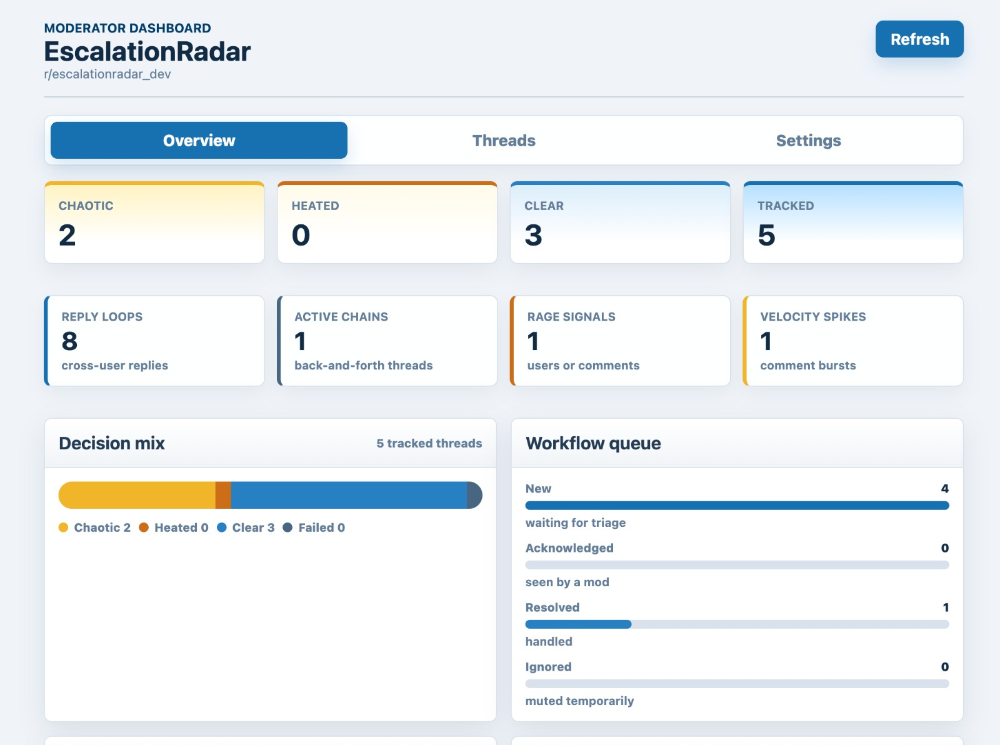
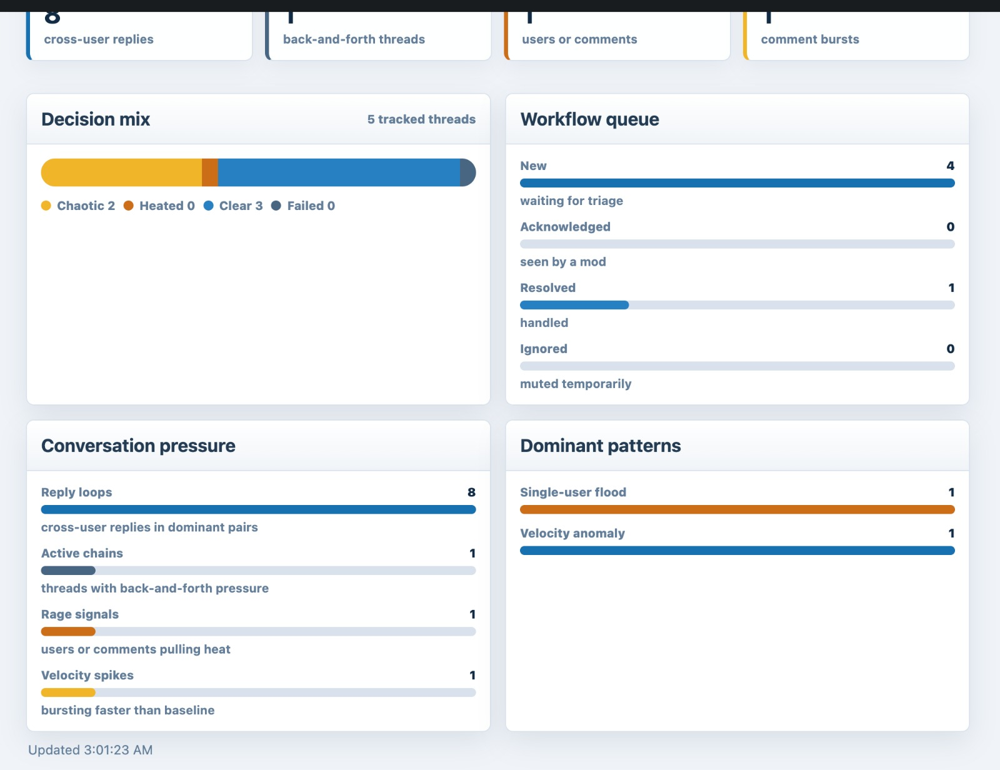
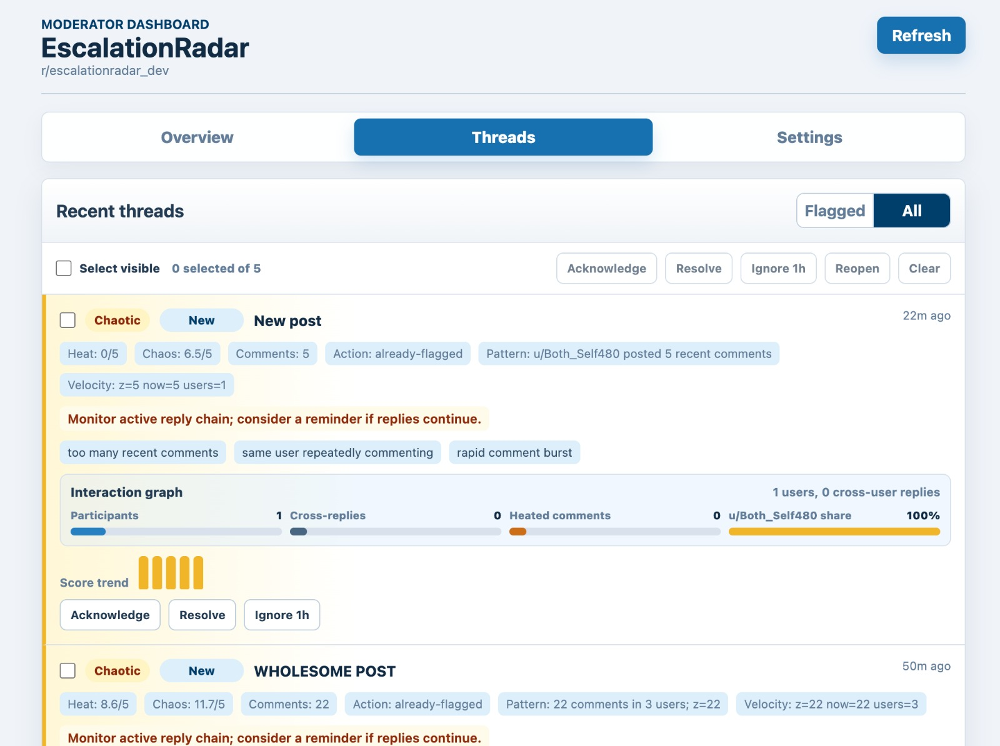
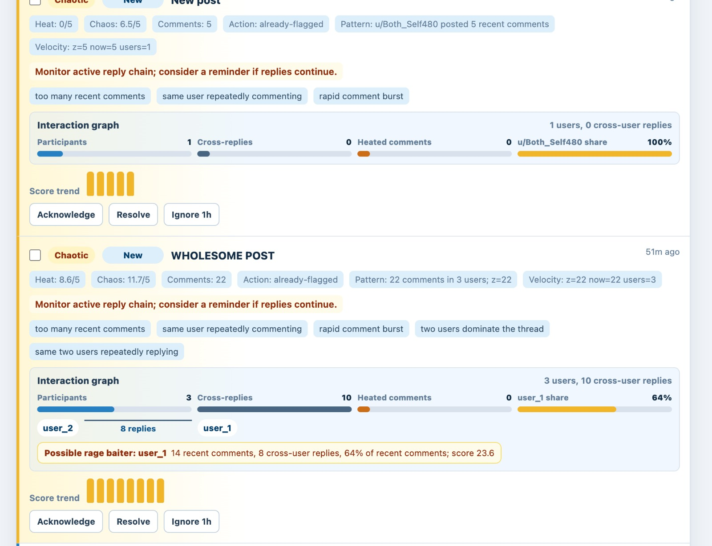
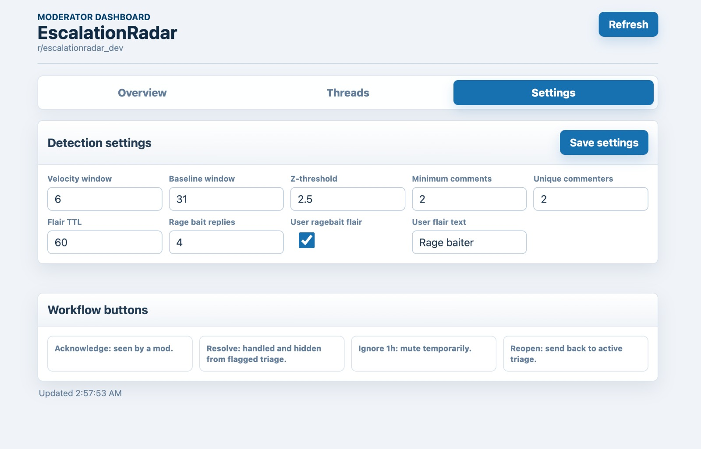
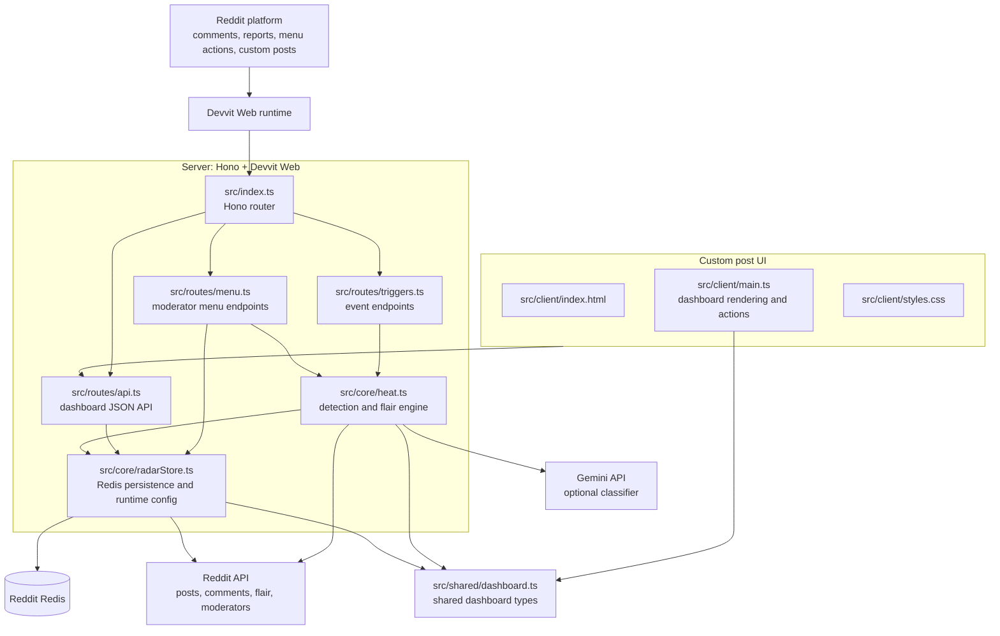
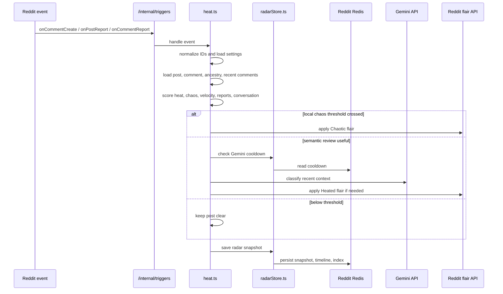
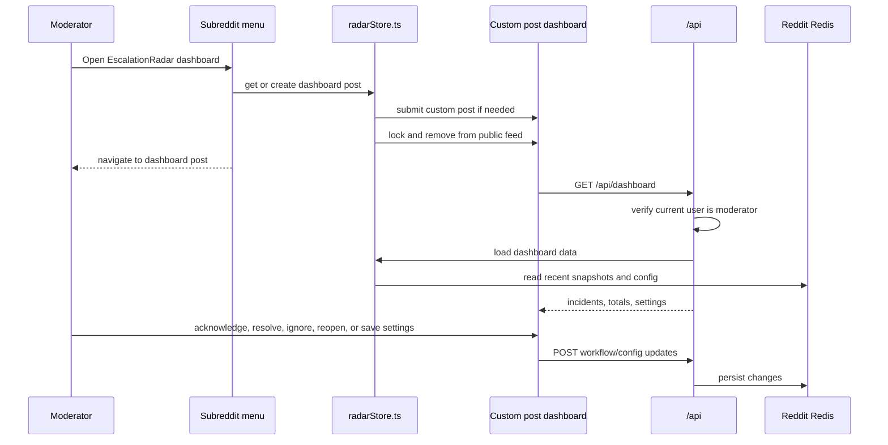

# EscalationRadar


EscalationRadar is a Reddit Devvit moderation app that detects when a thread is heating up, turning chaotic, or attracting concentrated reports. It adds visible post flair such as `Heated` or `Chaotic`, stores the incident in Redis, and gives moderators a custom dashboard for triage.

The app is designed as an early-warning system, not an enforcement bot. It helps moderators see risky conversations sooner while keeping final judgment with humans.

## Demo Video

*(Click the image below to play the demo video)*<br/>
[](https://youtu.be/_TKuSqt8TWc?si=oAwFHJNA0MJt_X5y)

## Contents

- [Demo Video](#demo-video)
- [What Exists Today](#what-exists-today)
- [Screenshots](#screenshots)
- [Moderator Workflow](#moderator-workflow)
- [Architecture](#architecture)
- [Detection Engine](#detection-engine)
- [Dashboard](#dashboard)
- [Configuration](#configuration)
- [API, Menu, and Trigger Surface](#api-menu-and-trigger-surface)
- [Data Stored in Redis](#data-stored-in-redis)
- [Gemini Setup](#gemini-setup)
- [Development](#development)
- [Demo Script](#demo-script)
- [Future Improvements](#future-improvements)

## What Exists Today

### Automatic thread detection

EscalationRadar watches Reddit comment and report events and scores the parent post for moderation risk.

| Capability | Current behavior |
|---|---|
| Comment event scoring | Runs on `onCommentCreate` and analyzes the newest comment plus recent thread context. |
| Heated detection | Scores charged terms, argument phrases, direct reply language, high caps ratio, escalating punctuation, fast comment bursts, cross-author replies, repeated heated language, and active branch escalation. |
| Chaotic detection | Detects high recent volume, rapid bursts, two-user domination, repeated replies between the same two users, one-user floods, and comments pulling many replies. |
| Velocity anomaly detection | Compares a short current window against a longer baseline window and flags spikes using a configurable z-score. |
| Report burst detection | Watches post reports and comment reports over a 10-minute Redis window. |
| Targeted report detection | Detects repeated reports against the same author within a post and across posts. |
| Optional Gemini classifier | Uses Gemini only after cheaper local signals decide semantic review is useful, unless configured to send every comment. |
| Flair automation | Applies `Heated` or `Chaotic` post flair when thresholds are crossed. `Chaotic` wins when both are true because Reddit displays one post flair. |
| Idle flair cleanup | Removes a managed flair when no new comments arrive within the configurable flair TTL. |
| Rage-bait signals | Identifies a possible rage-baiting user or comment when one actor/comment pulls disproportionate replies and heat. |
| User flair | Optionally applies a mod-only user flair such as `Rage baiter` to detected actors. |
| Manual mod actions | Adds menu actions to check a thread, manually mark heated, manually mark chaotic, and open the dashboard. |
| Moderator dashboard | Custom post UI with overview charts, incident list, conversation summaries, timelines, workflow state, and runtime settings. |
| Redis persistence | Stores dashboard incidents for seven days and score timelines for recent checks. |
| Moderator-only API | Dashboard and workflow APIs verify the current viewer is a subreddit moderator. |

## Screenshots

These screenshots show the current Devvit dashboard experience.

### Dashboard Overview



### Dashboard Analytics



### Thread Triage



### Thread Detail



### Detection Settings



### Reddit Flair Result

Placeholder for a future Reddit post screenshot after EscalationRadar applies the `Heated` or `Chaotic` flair:

`docs/screenshots/reddit-flair-result.png`

## Moderator Workflow

1. A user adds a new comment or a post/comment receives reports.
2. EscalationRadar loads the relevant post, newest comment, recent comments, and parent ancestry.
3. The detection engine computes heat, chaos, velocity, report, and conversation signals.
4. If thresholds are crossed, the app applies the configured post flair.
5. The app saves a dashboard snapshot in Reddit Redis.
6. Moderators open the dashboard from the subreddit menu.
7. Moderators inspect scores, reasons, trends, and conversation patterns.
8. Moderators mark incidents as `Acknowledged`, `Resolved`, `Ignored for 1 hour`, or `Reopened`.

## Architecture

### Component Architecture



### Detection Flow



### Dashboard Flow



## Detection Engine

The main detection logic lives in `src/core/heat.ts`.

### Heat signals

- Charged terms such as insults and profanity.
- Argument phrases such as direct contradiction or bad-faith callouts.
- Direct reply language using `you`, `your`, or similar phrasing.
- High uppercase ratio.
- Repeated `!` or `?` punctuation.
- High recent comment volume.
- Fast comment bursts.
- Cross-author replies.
- Repeated heated comments in the same window.
- A new reply continuing an already active branch.
- A comment that attracts many direct replies.

### Chaos signals

- Too many recent comments for the configured threshold.
- One user repeatedly commenting in the same thread.
- Rapid activity in the last 10 minutes.
- Two users dominating the recent comment window.
- The same two users repeatedly replying to each other.
- A single comment pulling many replies from multiple users.
- Velocity anomaly compared with the baseline window.

### Report signals

| Signal | Threshold |
|---|---:|
| Post report burst | 3 reports on the same post in 10 minutes |
| Comment report burst under one post | 5 reports under the same post in 10 minutes |
| Targeted reports in one post | 2 reports targeting comments by the same author in one post |
| Targeted reports across posts | 4 reports targeting comments by the same author across posts |

### Conversation summary

Each saved incident can include:

- Participant count.
- Cross-user reply count.
- Heated comment count.
- Top author by comment count and heat.
- Top pair by reply count.
- Possible rage-baiting user.
- Possible rage-bait comment.
- Short score timeline for trend display.

## Dashboard

The dashboard is a Devvit custom post rendered from `src/client/`.

### Overview tab

- Counts for `Chaotic`, `Heated`, `Clear`, and total tracked threads.
- Reply-loop, active-chain, rage-signal, and velocity-spike counters.
- Decision mix chart.
- Workflow queue chart.
- Conversation pressure chart.
- Dominant pattern chart.

### Threads tab

- Flagged-only or all-incident filters.
- Bulk selection for visible incidents.
- Bulk workflow actions: acknowledge, resolve, ignore for one hour, reopen, and clear selection.
- Incident rows with title, decision, workflow state, checked time, heat score, chaos score, action, pattern, velocity, reasons, suggested action, interaction graph, and score trend.

### Settings tab

- Velocity window.
- Baseline window.
- Z-threshold.
- Minimum comments in current window.
- Unique commenter threshold.
- Managed flair TTL.
- Rage-bait reply threshold.
- User rage-bait flair toggle.
- User flair text.

The dashboard refreshes every 30 seconds and also has a manual refresh button.

## Configuration

Subreddit-level settings are declared in `devvit.json`.

| Setting | Purpose | Default |
|---|---|---:|
| `enabled` | Enable automatic heat detection. | `true` |
| `heatThreshold` | Minimum heat score before applying heated flair. | `5` |
| `sampleSize` | Number of recent comments to inspect. | `30` |
| `lookbackMinutes` | Recent comment window for heat scoring. | `45` |
| `flairText` | Heated post flair text. | `Heated` |
| `chaoticFlairText` | Chaotic post flair text. | `Chaotic` |
| `chaoticThreshold` | Minimum chaos score before applying chaotic flair. | `5` |
| `chaoticCommentThreshold` | Recent comment count that contributes to chaos. | `4` |
| `chaoticReplyThreshold` | Repeated direct replies that contribute to chaos. | `2` |
| `autoCreateFlair` | Create or reuse mod-only flair templates. | `true` |
| `useGemini` | Enable optional Gemini classification. | `true` |
| `sendAllToGemini` | Send every comment event to Gemini instead of using the heuristic gate. | `false` |
| `geminiModel` | Gemini model name. | `gemini-flash-latest` |

Global secret setting:

| Setting | Purpose |
|---|---|
| `geminiApiKey` | Secret key for the Gemini API. |

Runtime dashboard settings are stored in Redis so moderators can tune them from the UI without changing code.

| Runtime setting | Default |
|---|---:|
| `velocityWindowMinutes` | `5` |
| `baselineWindowMinutes` | `30` |
| `velocityZThreshold` | `2.5` |
| `minimumCommentsInWindow` | `4` |
| `uniqueCommenterThreshold` | `3` |
| `flairTtlMinutes` | `60` |
| `rageBaitReplyThreshold` | `4` |
| `rageBaiterUserFlairEnabled` | `true` |
| `rageBaiterUserFlairText` | `Rage baiter` |

## API, Menu, and Trigger Surface

### Public dashboard API

| Method | Route | Purpose |
|---|---|---|
| `GET` | `/api/dashboard?subredditName=<name>` | Returns dashboard totals, config, and incidents after moderator verification. |
| `POST` | `/api/incident-state` | Updates an incident workflow state. |
| `POST` | `/api/dashboard-config` | Updates runtime dashboard detection settings. |

### Internal menu endpoints

| Menu item | Endpoint | Purpose |
|---|---|---|
| `Open EscalationRadar dashboard` | `/internal/menu/open-dashboard` | Creates or opens the dashboard custom post. |
| `Check thread heat` | `/internal/menu/check-thread-heat` | Scores the selected post or comment parent thread. |
| `Mark as heated` | `/internal/menu/mark-heated` | Forces the configured heated flair. |
| `Mark as chaotic` | `/internal/menu/mark-chaotic` | Forces the configured chaotic flair. |

### Internal trigger endpoints

| Devvit trigger | Endpoint | Purpose |
|---|---|---|
| `onAppInstall` | `/internal/triggers/on-app-install` | Prepares post flair templates when enabled. |
| `onCommentCreate` | `/internal/triggers/on-comment-create` | Runs automatic thread heat and chaos scoring. |
| `onPostReport` | `/internal/triggers/on-post-report` | Records post-report burst signals. |
| `onCommentReport` | `/internal/triggers/on-comment-report` | Records comment-report and targeted-author signals. |

## Data Stored in Redis

Redis is used for lightweight incident state, report windows, cooldowns, and dashboard configuration.

| Data | Key shape | Retention |
|---|---|---|
| Dashboard post ID | `radar:<subreddit>:dashboard-post` | Persistent until replaced |
| Dashboard incident index | `radar:<subreddit>:threads` | Pruned to seven days |
| Thread snapshot | `radar:<subreddit>:thread:<postId>` | Seven days |
| Runtime config | `radar:<subreddit>:runtime-config` | Persistent |
| Gemini cooldown | `radar:<subreddit>:gemini-cooldown:<postId>` | 60 seconds |
| Post report window | `radar:<subreddit>:reports:post:<postId>` | 10-minute rolling window |
| Comment author report window | `radar:<subreddit>:reports:post-author:<postId>:<author>` | 10-minute rolling window |
| Author report window | `radar:<subreddit>:reports:author:<author>` | 10-minute rolling window |

## Gemini Setup

Gemini is optional. EscalationRadar still works with local heuristics when Gemini is disabled, a key is missing, or the API is unavailable.

Gemini calls are gated and rate-limited:

- Skipped when local scores are below the heat threshold, unless `sendAllToGemini` is enabled.
- Skipped for chaotic threads because local chaos signals already explain the risk.
- Limited by a per-post 60-second Redis cooldown.
- Timed out after eight seconds.
- Parsed as strict JSON.

Store the key as a Devvit secret:

```bash
npx devvit settings set geminiApiKey
```

Do not commit API keys. If a key appears in chat, logs, or source control, rotate it before real subreddit use.

## Development

Install dependencies:

```bash
npm install
```

Log in to Devvit:

```bash
npm run login
```

Run type checks:

```bash
npm run type-check
```

Run lint:

```bash
npm run lint
```

Build:

```bash
npm run build
```

Playtest with Devvit:

```bash
npm run dev
```

Deploy/upload:

```bash
npm run deploy
```

Publish:

```bash
npm run launch
```

## Demo Script

1. Install the app on a Devvit test subreddit.
2. Create a normal discussion post.
3. Add several comments from different users or test accounts.
4. Create one of these escalation patterns:
   - A heated reply with direct language and punctuation.
   - A quick back-and-forth between two users.
   - Three or more recent comments from one user.
   - Several reports on the same post or against the same author.
5. Use `Check thread heat` from the post or comment moderator menu.
6. Show the `Heated` or `Chaotic` flair applied to the parent post.
7. Use `Open EscalationRadar dashboard` from the subreddit moderator menu.
8. Show the overview charts, recent incident row, reasons, interaction graph, score trend, and suggested action.
9. Change a runtime setting in the dashboard settings tab and save it.
10. Mark the incident as acknowledged, ignored, resolved, and reopened to show the workflow.

## Project Structure

```text
escalation-radar/
  devvit.json                 Devvit app config, triggers, menu items, settings
  vite.config.ts              Devvit Web Vite integration
  src/
    index.ts                  Hono server entrypoint
    routes/
      api.ts                  Moderator-verified dashboard API
      menu.ts                 Moderator menu actions
      triggers.ts             Devvit trigger handlers
    core/
      heat.ts                 Main detection, flair, Gemini, and report logic
      radarStore.ts           Redis persistence, dashboard post, config, workflow
    shared/
      dashboard.ts            Shared dashboard and incident types
    client/
      index.html              Custom post dashboard markup
      main.ts                 Dashboard rendering, charts, actions, polling
      styles.css              Responsive dashboard styling
```

## Future Improvements

### Product and moderation workflow

- Add modmail or private moderator comment alerts when a thread crosses a high threshold.
- Add a reversible `undo flair` action that restores the previous post flair.
- Add per-subreddit allowlists for community-specific words that should not raise heat.
- Add per-topic sensitivity profiles, for example `news`, `sports`, `support`, or `local`.
- Add an escalation playbook field so communities can map signals to their own mod policies.
- Add "assign to moderator" and internal notes on incidents.
- Add CSV export for weekly moderation review.

### Detection quality

- Add richer trend charts from the saved Redis score timeline.
- Add reply-depth and branch-width features to distinguish one intense branch from whole-thread chaos.
- Add author history signals such as recent removed comments, prior warnings, or repeated incident involvement.
- Add subreddit-specific false-positive feedback from moderators.
- Add configurable cool-downs for repeated flair writes.
- Add confidence tiers such as `watch`, `heated`, `chaotic`, and `critical`.

### Dashboard polish

- Add searchable and sortable incident tables.
- Add direct deep links to the most important comment or rage-bait candidate.
- Add a compact mobile triage mode for moderators on phones.
- Add keyboard shortcuts for reviewing incidents quickly.
- Add a screenshot-ready demo state with seeded sample incidents.

### Reliability and operations

- Add unit tests around scoring thresholds and Redis snapshot normalization.
- Add integration tests for API moderator checks and workflow transitions.
- Add structured logging for classifier decisions and flair writes.
- Add health indicators for Redis, Reddit API, and Gemini availability.
- Add a migration path if dashboard snapshot schemas change.

## Submission Positioning

EscalationRadar is strong as a hackathon project because it combines visible user-facing impact with practical moderator workflow:

- It reduces time-to-awareness for fast-moving discussions.
- It avoids automatic punishment and leaves enforcement to moderators.
- It works with local heuristics even without external AI.
- It includes polished demo surfaces: automatic triggers, manual menu actions, flair changes, report handling, and a custom dashboard.
- It is configurable enough for different subreddit cultures without code changes.

## License

BSD-3-Clause. See [LICENSE](LICENSE).
